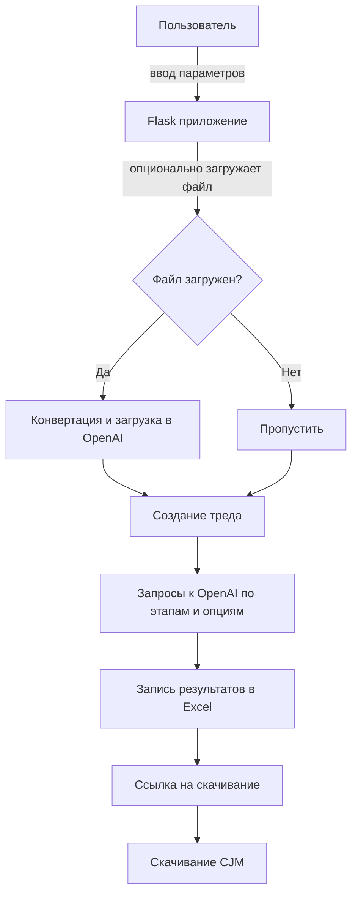

# CJM_bot

Инструмент, который создаёт карту пути клиента (CJM) с помощью моделей OpenAI.

## Как работает программа

1. Пользователь открывает веб-страницу и вводит *категорию* и *клиента*.
2. Выбирает интересующие этапы путешествия и опции анализа.
3. При необходимости загружает файл с комментариями в формате CSV или XLSX.
4. Приложение на Flask сохраняет файл, конвертирует его в текст и передаёт в OpenAI.
5. Для каждой пары «этап–опция» формируется запрос к модели и ожидается ответ.
6. Ответы заносятся в динамически созданный Excel-файл, формируя таблицу CJM.
7. Пользователь получает ссылку на скачивание готового файла и может загрузить CJM.

## Схема процесса



## Запуск

```bash
python CJM_App/UInt/app.py
```

После запуска приложение будет доступно по адресу `http://localhost:5000`.

## Деплой на Vercel

1. Подключите репозиторий к [Vercel](https://vercel.com) и задайте переменную окружения `OPENAI_API_KEY`.
2. Конфигурация в `vercel.json` направляет все запросы в Flask-приложение `CJM_App/UInt/app.py` и включает статические файлы и шаблоны.
3. После импортирования проекта Vercel установит зависимости из `CJM_App/requirements.txt` и задеплоит приложение как serverless-функцию.
